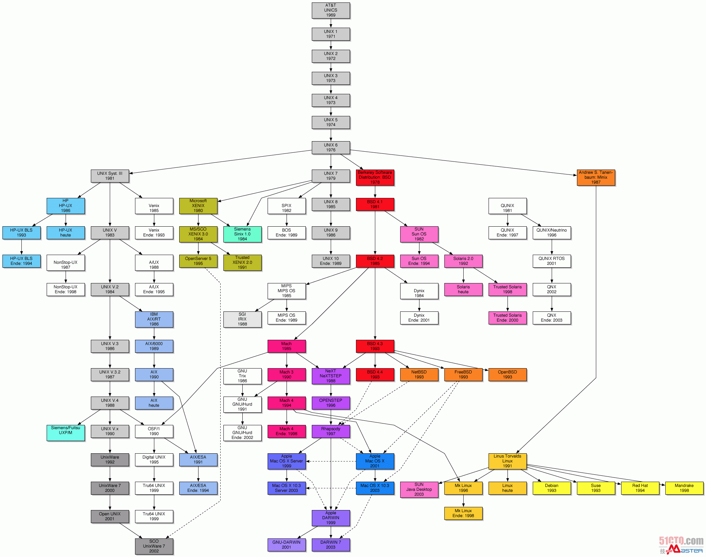

## 玩转Linux操作系统

### 操作系统发展史



### Linux概述

Linux是一个通用操作系统。一个操作系统要负责任务调度、内存分配、处理外围设备I/O等操作。操作系统通常由内核和系统程序（设备驱动、底层库、shell、服务程序等）两部分组成。

Linux内核是芬兰人Linus Torvalds开发的，于1991年9月发布。而Linux操作系统作为Internet时代的产物，它是由全世界许多开发者共同合作开发的，是一个自由的操作系统（注意是自由不是免费）。

### Linux系统优点

1. 通用操作系统，不跟特定的硬件绑定。
2. 用C语言编写，有可移植性，有内核编程接口。
3. 支持多用户和多任务，支持安全的分层文件系统。
4. 大量的实用程序，完善的网络功能以及强大的支持文档。
5. 可靠的安全性和良好的稳定性，对开发者更友好。

### 基础命令

Linux系统的命令通常都是如下所示的格式：

```Shell
命令名称 [命名参数] [命令对象]
```

1. 获取登录信息 - **w** / **who** / **last**。

   ```Shell
   [root@izwz97tbgo9lkabnat2lo8z ~]# w
    23:31:16 up 12:16,  2 users,  load average: 0.00, 0.01, 0.05
   USER     TTY      FROM             LOGIN@   IDLE   JCPU   PCPU WHAT
   root     pts/0    182.139.66.250   23:03    4.00s  0.02s  0.00s w
   jackfrue pts/1    182.139.66.250   23:26    3:56   0.00s  0.00s -bash
   [root@izwz97tbgo9lkabnat2lo8z ~]# who
   root     pts/0        2018-04-12 23:03 (182.139.66.250)
   jackfrued pts/1        2018-04-12 23:26 (182.139.66.250)
   [root@izwz97tbgo9lkabnat2lo8z ~]# who am i
   root     pts/0        2018-04-12 23:03 (182.139.66.250)
   ```

2. 查看自己使用的Shell - **ps**。

   Shell也被称为“壳”，它是用户与内核交流的翻译官，简单的说就是人与计算机交互的接口。目前很多Linux系统默认的Shell都是bash（<u>B</u>ourne <u>A</u>gain <u>SH</u>ell），因为它可以使用Tab键进行命令补全、可以保存历史命令、可以方便的配置环境变量以及执行批处理操作等。

   ```Shell
   [root@izwz97tbgo9lkabnat2lo8z ~]# ps
     PID TTY          TIME CMD
    3531 pts/0    00:00:00 bash
    3553 pts/0    00:00:00 ps
   ```

3. 查看命令的说明 - **whatis**。

   ```Shell
   [root@izwz97tbgo9lkabnat2lo8z ~]# whatis ps
   ps (1)        - report a snapshot of the current processes.
   [root@izwz97tbgo9lkabnat2lo8z ~]# whatis python
   python (1)    - an interpreted, interactive, object-oriented programming language
   ```

4. 查看命令的位置 - **which** / **whereis**。

   ```Shell
   [root@izwz97tbgo9lkabnat2lo8z ~]# whereis ps
   ps: /usr/bin/ps /usr/share/man/man1/ps.1.gz
   [root@izwz97tbgo9lkabnat2lo8z ~]# whereis python
   python: /usr/bin/python /usr/bin/python2.7 /usr/lib/python2.7 /usr/lib64/python2.7 /etc/python /usr/include/python2.7 /usr/share/man/man1/python.1.gz
   [root@izwz97tbgo9lkabnat2lo8z ~]# which ps
   /usr/bin/ps
   [root@izwz97tbgo9lkabnat2lo8z ~]# which python
   /usr/bin/python
   ```

5. 查看帮助文档 - **man** / **info** / **apropos**。
   ```Shell
   [root@izwz97tbgo9lkabnat2lo8z ~]# ps --help
   Usage:
    ps [options]
    Try 'ps --help <simple|list|output|threads|misc|all>'
     or 'ps --help <s|l|o|t|m|a>'
    for additional help text.
   For more details see ps(1).
   [root@izwz97tbgo9lkabnat2lo8z ~]# man ps
   PS(1)                                User Commands                                PS(1)
   NAME
          ps - report a snapshot of the current processes.
   SYNOPSIS
          ps [options]
   DESCRIPTION
   ...
   [root@izwz97tbgo9lkabnat2lo8z ~]# info ps
   ...
   ```

6. 切换用户 - **su**。

   ```Shell
   [root@izwz97tbgo9lkabnat2lo8z ~]# su hellokitty
   [hellokitty@izwz97tbgo9lkabnat2lo8z root]$
   ```

7. 以管理员身份执行命令 - **sudo**。

   ```Shell
   [jackfrued@izwz97tbgo9lkabnat2lo8z ~]$ ls /root
   ls: cannot open directory /root: Permission denied
   [jackfrued@izwz97tbgo9lkabnat2lo8z ~]$ sudo ls /root
   [sudo] password for jackfrued:
   calendar.py  code  error.txt  hehe  hello.c  index.html  myconf  result.txt
   ```

   > **说明**：如果希望用户能够以管理员身份执行命令，用户必须在sudoers（/etc/sudoers）名单中。

8. 登入登出相关 - **logout** / **exit** / **adduser** / **userdel** / **passwd** / **ssh**。

   ```Shell
   [root@izwz97tbgo9lkabnat2lo8z ~]# adduser jackfrued
   [root@izwz97tbgo9lkabnat2lo8z ~]# passwd jackfrued
   Changing password for user jackfrued.
   New password:
   Retype new password:
   passwd: all authentication tokens updated successfully.
   [root@izwz97tbgo9lkabnat2lo8z ~]# ssh hellokitty@1.2.3.4
   hellokitty@1.2.3.4's password:
   Last login: Thu Apr 12 23:05:32 2018 from 10.12.14.16
   [hellokitty@izwz97tbgo9lkabnat2lo8z ~]$ logout
   Connection to 1.2.3.4 closed.
   [root@izwz97tbgo9lkabnat2lo8z ~]#
   ```

9. 查看系统和主机名 - **uname** / **hostname**。

   ```Shell
   [root@izwz97tbgo9lkabnat2lo8z ~]# uname
   Linux
   [root@izwz97tbgo9lkabnat2lo8z ~]# hostname
   izwz97tbgo9lkabnat2lo8z
   [root@iZwz97tbgo9lkabnat2lo8Z ~]# cat /etc/centos-release
   CentOS Linux release 7.4.1708 (Core) 
   ```

10. 重启和关机 - **reboot** / **init 6** / **shutdown** / **init 0**。

11. 查看历史命令 - **history**。

### 实用程序

#### 文件和文件夹操作

1. 创建/删除目录 - **mkdir** / **rmdir**。

2. 创建/删除文件 - **touch** / **rm**。

   - touch命令用于创建空白文件或修改文件时间。在Linux系统中一个文件有三种时间：
     - 更改内容的时间（mtime）
     - 更改权限的时间（ctime）
     - 最后访问时间（atime）

3. 切换和查看当前工作目录 - **cd** / **pwd**。

4. 查看目录内容 - **ls**。

5. 查看文件内容 - **cat** / **head** / **tail** / **more** / **less**。

6. 拷贝/移动文件 - **cp** / **mv**。

7. 查看文件及内容 - **find** / **grep**。

   ```Shell
   [root@izwz97tbgo9lkabnat2lo8z ~]# find -name *.html
   ./index.html
   ./code/index.html
   [root@izwz97tbgo9lkabnat2lo8z ~]# grep "<script>" . -R -n
   ./index.html:15:                <script>
   ./code/index.html:2884: <script>
   ./code/foo.html:2:<!--STATUS OK--><html> <head><meta ...
   ```

8. 符号链接 - **ln**。

9. 压缩和归档 - **gzip** / **gunzip** / **xz** / **tar**。

10. 其他工具 - **sort** / **uniq** / **diff** / **file** / **wc**。

#### 管道和重定向

1. 管道的使用 - **\|**。
2. 输出重定向和错误重定向 - **\>** / **2\>**。
3. 输入重定向 - **\<**。

#### 别名

1. **alias**
2. **unalias**

#### 其他程序

1. 时间和日期 - **date** / **cal**。
2. 录制操作脚本 - **script**。
3. 给用户发送消息 - **mesg** / **write** / **wall** / **mail**。

### 文件系统

#### 文件和路径

1. 命名规则
2. 扩展名
3. 隐藏文件
4. 工作目录和主目录
5. 绝对路径和相对路径

#### 目录结构

1. /bin - 基本命令的二进制文件
2. /boot - 引导加载程序的静态文件
3. /dev - 设备文件
4. /etc - 配置文件
5. /home - 用户主目录的父目录
6. /lib - 共享库文件
7. /lib64 - 共享64位库文件
8. /lost+found - 存放未链接文件
9. /media - 自动识别设备的挂载目录
10. /mnt - 临时挂载文件系统的挂载点
11. /opt - 可选插件软件包安装位置
12. /proc -  内核和进程信息
13. /root - root账户主目录
14. /run - 存放系统运行时需要的东西
15. /sbin - 超级用户的二进制文件
16. /sys - 设备的伪文件系统
17. /tmp - 临时文件夹
18. /usr - 用户应用目录
19. /var - 变量数据目录

#### 访问权限

1. **chmod**。
2. **chown**。

#### 磁盘管理

1. 列出文件系统的磁盘使用状况 - **df**。
2. 磁盘分区表操作 - **fdisk**。
3. 格式化文件系统 - **mkfs**。
4. 文件系统检查 - **fsck**。
5. 挂载/卸载 - **mount** / **umount**。

### 编辑器vim

1. 启动和退出

2. 命令模式和编辑模式

3. 光标操作

4. 文本操作

5. 查找和替换

   /正则表达式

   :1,$s/正则表达式/替换后的内容/gice

   g - global

   i - ignore case

   c - confirm

   e - error

6. 参数设定

   .vimrc

   set ts=4

   set nu

7. 高级技巧

   - 映射快捷键
     - inoremap key:...
   - 录制宏
     - 在命令模式下输入qa开始录制宏（qa/qb/qc/qd）
     - 执行你的操作，这些操作都会被录制下来
     - 如果要录制的操作完成了，按q结束录制
     - @a播放宏（1000@a - 将宏播放1000次）

### 环境变量

1. HOME
2. SHELL
3. HISTSIZE
4. RANDOM
5. PATH

### 软件安装和配置

#### yum

- yum update
- yum install / yum remove
- yum list / yum search
- yum makecache

#### rpm

- rpm -ivh \-\-force \-\-nodeps
- rpm -e 
- rpm -qa | grep

#### 源代码构建安装

- ...
- make && make install

#### 实例

1. 安装MySQL。
2. 安装Redis。
3. 安装NginX。

### 配置服务

1. systemctl start / stop / restart / status
2. systemctl enable / disable
3. 计划任务 - **crontab**。
4. 开机自启。

### 网络访问和管理

1. 通过网络获取资源 - **wget**。
   - -b 后台下载模式
   - -O 下载到指定的目录
   - -r 递归下载
2. 显示/操作网络配置（旧） - **ipconfig**。
3. 显示/操作网络配置（新） - **ip**。
4. 网络可达性检查 - **ping**。
5. 查看网络服务和端口 - **netstat**。
6. 安全文件拷贝 - **scp**。
7. 安全文件传输 - **sftp**。

### Shell和Shell编程

1. 通配符。
2. 后台运行。

### 其他内容

1. awk
2. sed
3. xargs